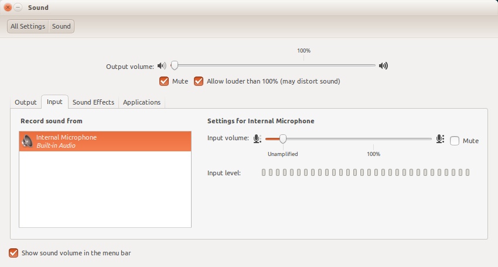

## Tornado
Tornado is a Python web framework and asynchronous networking library.
### Installing tornado
```bash
sudo pip install tornado
```
Tornado is used here to make a socket server to recieve and broadcast data through a websocket.
* Using google chrome speech recognition api, the speech is recognized and this data is sent to the tornado server.
* Tornado is broadcasting the same data to each and every client connected.
* With the help of java websocket client in the spout, this data is received and further submitted to the bolt(s) for processing.

### Before using Web Interface to provide speech input:

* Web Interface will work only with google chrome.
* It is strongly recommended to keep the input volume amplification level "unamplified" for your microphone.

